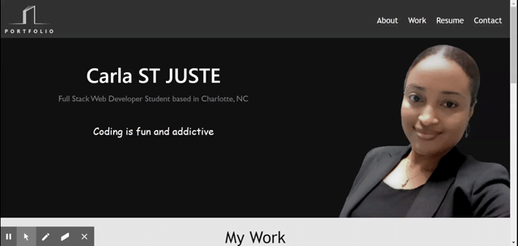

# Porfolio
This website present a portfolio of some of the projects that I have done so far as a full stack developer. 

## Deployed link
[portfolio](https://carlastjuste.github.io/Portfolio/)

## Prerequisites
This software can be used on :
* Google Chrome
* Microsoft Edge   
* Firefox
 It hasn't been tested on other browsers but it might works properly.  

## Technology  used
* HTML
* CSS
* Bootstrap

 ## Author
* [@carlastjuste](http://github.com/carlastjuste)

## License
This project is licensed under the MIT License - see the LICENSE.md file for details

